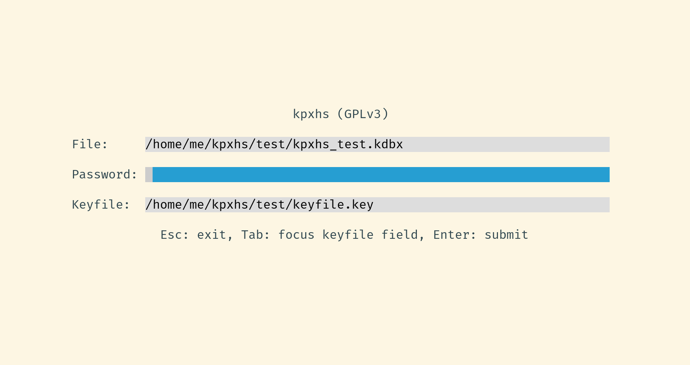
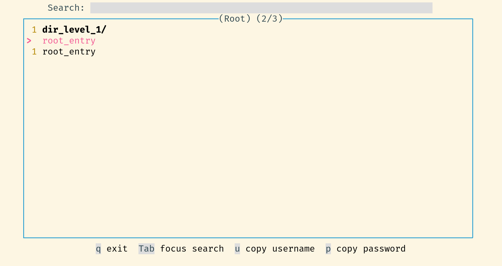
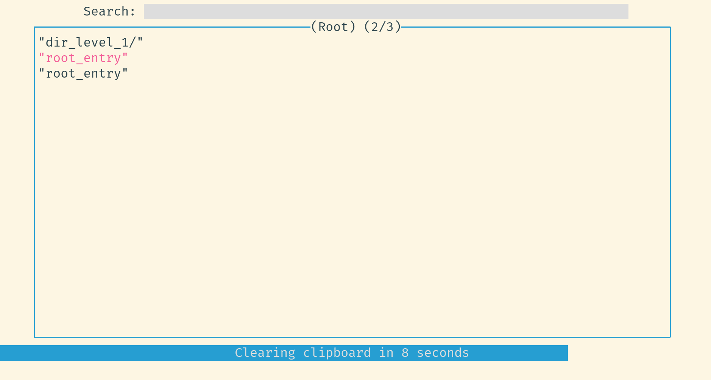
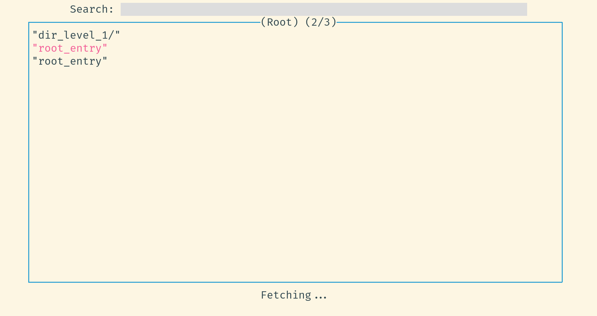
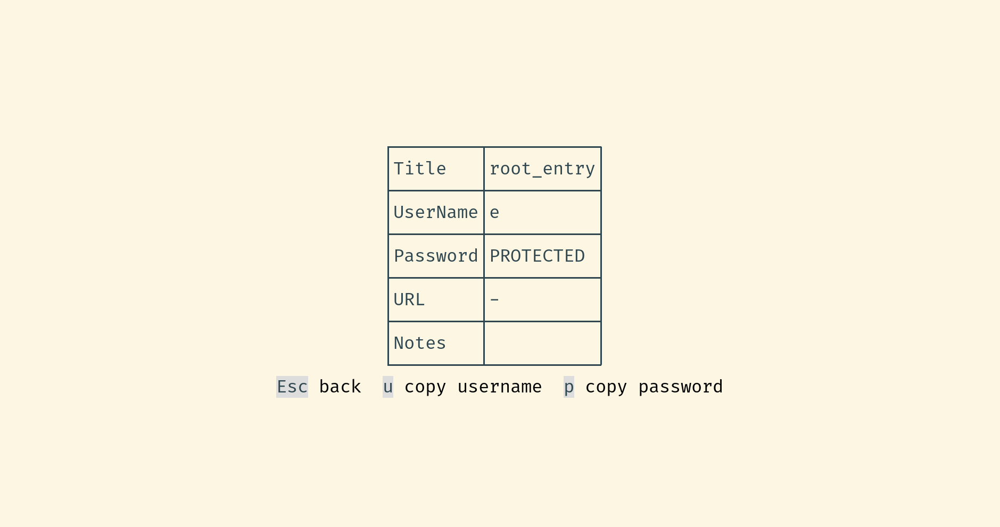
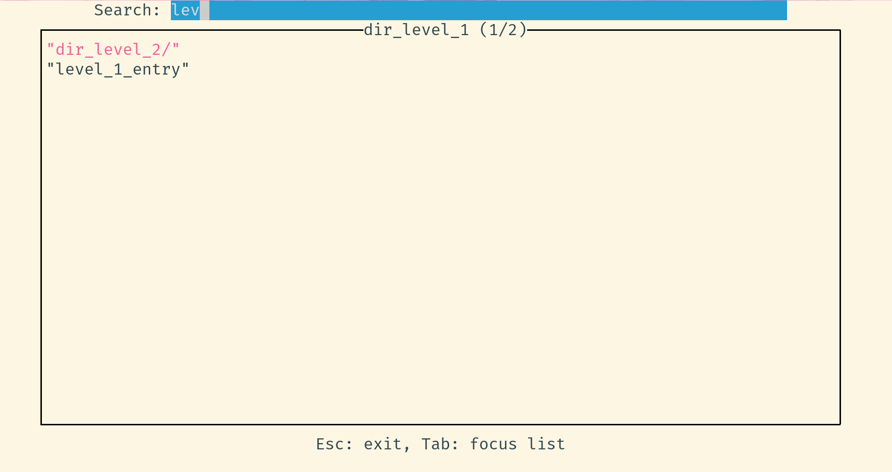
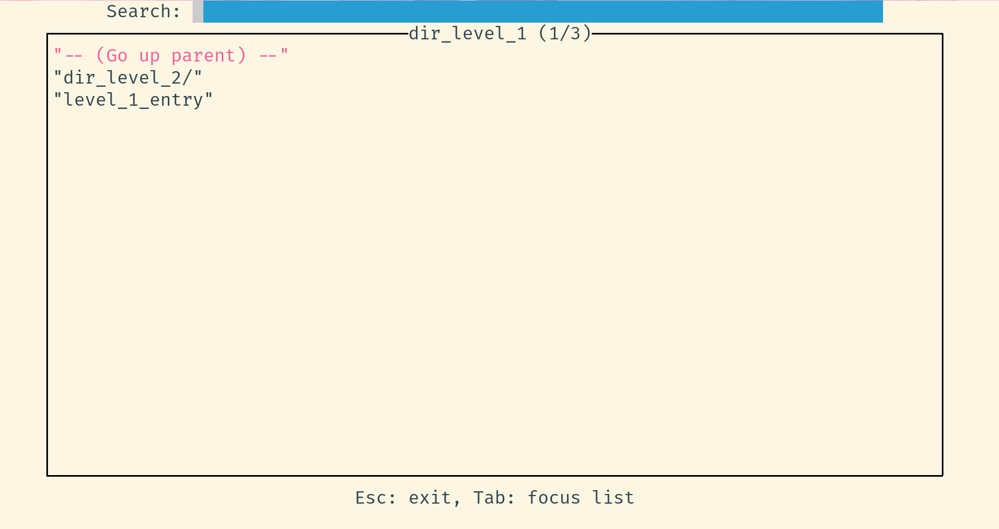
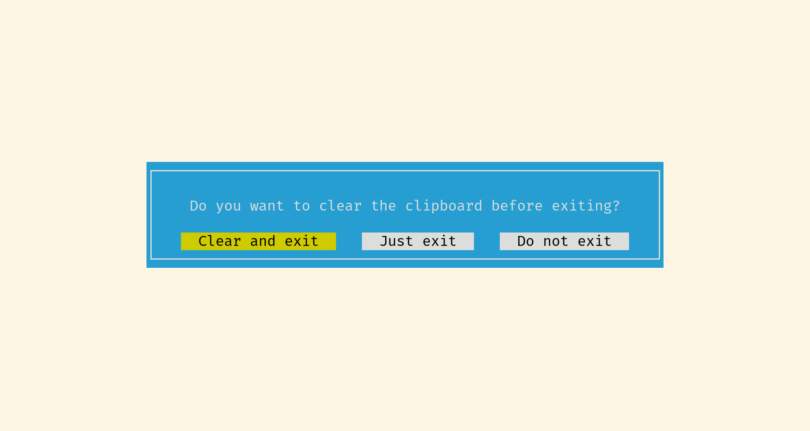

# kpxhs

[](https://GitHub.com/twenty5151/kpxhs/commit/)

[Keepass](https://keepass.info/) database interactive TUI viewer based on `keepassxc-cli`

















# Features
- Configurable database and keyfile path
- Browse entries and navigate directories
- View entry details
- Copy entry username and password fields to clipboard
- Clear clipboard on exit
- Clear clipboard after a configurable timeout
- Responsive messages in the footer

# Why
- Keyboard friendly way of accessing your passwords
- Fast(er)
    - No need to type your password for every command, unlike `keepassxc-cli`
        - Password is cached for the entire session (make sure to close it after you're done)
    - Entries details are cached
- Browser plugin doesn't work consistently for me
- View only (for now?) because I access passwords much more often than I add or edit them. In rare cases when I have to, using the mouse and GUI isn't such a hassle.
- Learn Haskell
- I use arch btw

\* If you want non-interactive (for scripting etc), just use keepassxc-cli directly


# Usage requirements
You need to install [keepassxc](https://github.com/keepassxreboot/keepassxc/) with `keepassxc-cli` and have it available in PATH. The few most recent versions should work, but if there are incompatibilities in future versions it will be noted here.

# Installing

## Install using pre-compiled binary

Just go to the [releases](https://github.com/twenty5151/kpxhs/releases/) page and grab the latest binary for your OS. Only UNIX (linux and macos) is supported. Binaries are compiled and uploaded using Github actions

## Build from source using [Stack](https://docs.haskellstack.org/en/stable/README/)

No superuser permissions are needed (unless if you need to install stack itself)

1. `git clone https://github.com/twenty5151/kpxhs`
2. `cd kpxhs`
3. Optional: `git checkout` your desired stable version tag (otherwise you will be using the unstable master branch)
4. `make build` (compile)
5. `make install` (move binary to `~/.local/bin/`)

The binary size can be reduced by enabling dynamic linking: add the`-dynamic` flag to `ghc-options` in [kpxhs.cabal](kpxhs.cabal).

# Manual (Usage, Configuration, Theming)

```sh
$ kpxhs -h
kpxhs - Interactive Keepass database TUI viewer
  Usage
    kpxhs                   Start the program
    kpxhs [-v | --version]  Print the version number
    kpxhs [-h | --help]     Show this help
    kpxhs --write-config    Write the default configs to ~/.config/kpxhs/

  TUI keybindings (in general)
    Esc                     Quit, back (elsewhere)
    q                       Quit, back (in browser)
    Tab                     Cycle focus
    Enter                   Show entry details
    u                       Copy username
    p                       Copy password

  Navigation ([n] means optional digit)
    [n]j, [n]s              Move down n items (default: 1)
    [n]k, [n]w              Move up n items   (default: 1)
    g                       Move to top
    G                       Move to bottom
    q                       Page up
    e                       Page down
```

Read the man page for more details. The rendered markdown is available online at https://github.com/twenty5151/kpxhs/blob/master/docs/out/kpxhs.1.md

Alternatively, it can be installed for offline reading manually. No superuser permissions are required. Copy the pre-built man page in [docs/out/kpxhs.1](https://github.com/twenty5151/kpxhs/raw/master/docs/out/kpxhs.1) to somewhere in your `manpath` (eg, `~/.local/share/man/man1/`). View with `man kpxhs`.

The man page can also be manually built with `cd docs && make` and installed with `make copy`. `pandoc` is required for this manual build. For the `whatis` program to work with `kpxhs`, refresh the mandb with `mandb` after `make copy`

# License

GPLv3 or later
