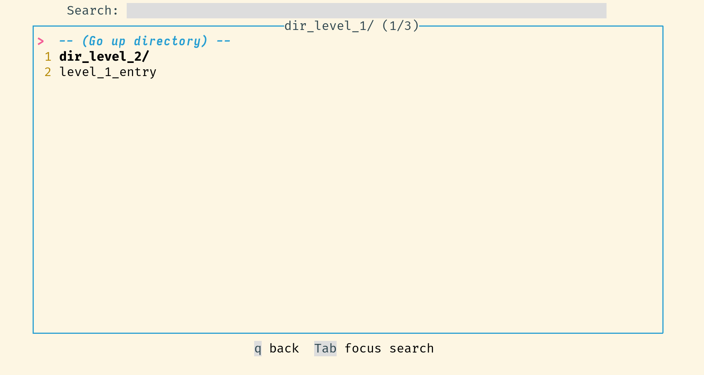
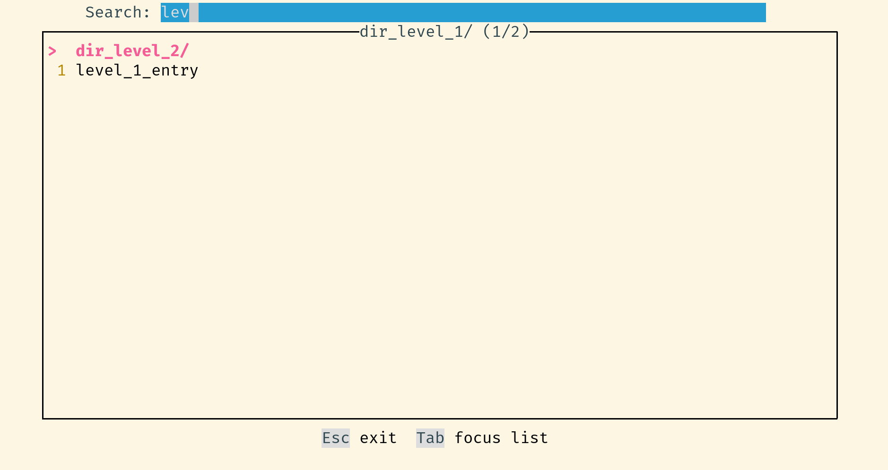

# kpxhs

[Keepass](https://keepass.info/) database interactive TUI viewer based on `keepassxc-cli`







# Features
- Default database path using config file
- Browse entries and navigate directories
- View entry details
- Copy entry username and password fields to clipboard
- Clear clipboard on exit

# Why
- Keyboard friendly way of accessing your passwords
- Fast(er)
    - No need to type your password for every command, unlike `keepassxc-cli`
        - Password is cached for the entire session (make sure to close it after you're done)
    - Entries details are cached
- Browser plugin doesn't work consistently for me
- View only (for now?) because I access passwords much more often than I add or edit them. In rare cases when I have to, using the mouse and GUI isn't such a hassle.
- Learn Haskell
- I use arch btw

\* If you want non-interactive (for scripting etc), just use keepassxc-cli directly


# Usage requirements
- A keepass client with `keepassxc-cli` in PATH
    - I recommend [keepassxc](https://github.com/keepassxreboot/keepassxc/)

# Installing

## Install using pre-compiled binary

Just go to the [releases](https://github.com/twenty5151/kpxhs/releases/) page and grab the latest binary for your OS. Only UNIX (linux and macos) is supported. Binaries are compiled and uploaded using Github actions

## Install from source using [Stack](https://docs.haskellstack.org/en/stable/README/)

1. `git clone https://github.com/twenty5151/kpxhs`
2. `cd kpxhs`
3. `stack build` (compile)
4. `stack install` (move binary to `~/.local/bin/`)

# Setup (optional)
- If you usually only use one database, you can add it into a config file so it's filled in by default, so you only need to enter your password. This is how keepassxc works by default.
- You can also have `kpxhs` auto-fill a path to the keyfile
- See also `test/example_config`

1. `mkdir ~/.config/kpxhs`
2. `vim ~/.config/kpxhs/config`
3. On the first line, add in the full path of your keepass database file
4. On the second line, add in the full path of your keyfile path
5. If there is only one line in the file, it will be interpreted as the keepass database file

# Usage

```sh
$ kpxhs -h
kpxhs - Interactive Keepass database TUI viewer
  Usage
    kpxhs                  Start the program
    kpxhs [-h | --help]    Show this help

  TUI keybindings (in general)
    Esc                    Quit
    Tab                    Cycle focus
    Enter                  Show entry details
    u                      Copy username
    p                      Copy password
  Navigation
    j, s                   Move down
    k, w                   Move up
    g                      Move to top
    G                      Move to bottom
    q                      Page up
    e                      Page down
```

## Keybindings

- Initial screen:
    - `Esc`: quit
    - `Tab`: switch focus between database path, password, and keyfile path fields
    - `Enter`: attempt unlock
- Browser view:
    - `Esc`: quit
    - If search bar is focused:
        - Just type and the list will be filtered in real-time
        - `Tab`: focus the list
    - If an entry in the list is focused:
        - `u`: copy username
        - `p`: copy the password
        - `Enter`: view entry details
        - `Tab` to focus search
        - Use `j`, `k`, `w`, and `s` to navigate
- Inside entry details:
    - `u`: copy username
    - `p`: copy the password
    - `Esc`: return to browser view

## Example usage

1. `kpxhs`
2. `YOUR_PASSWORD<Enter>` (Assuming database path stored in config and no keyfile)
3. (Focus is on search bar by default) `git` (List filtered to items with "git" in title)
4. `Tab` (Focus to list)
5. `j` (Focus one entry below)
6. `p` (Copy password)
7. `Esc` (quit)
8. (Focus is on clear clipboard and exit by default) `Enter` (clear clipboard and exit)

# License

GPLv3 or later

# Todo
- "please wait" indicator on login/enter dir/show entry
    - Difficulty is in the requirement to handle two events without user intervention in between
    - 1) Launch background IO task; 2) Set footer to "please wait"; 3) Wait for task to finish; 4) Return the task's result.
